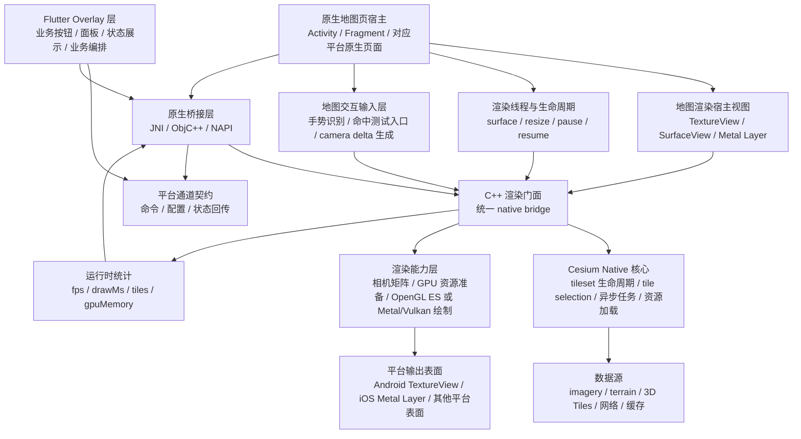
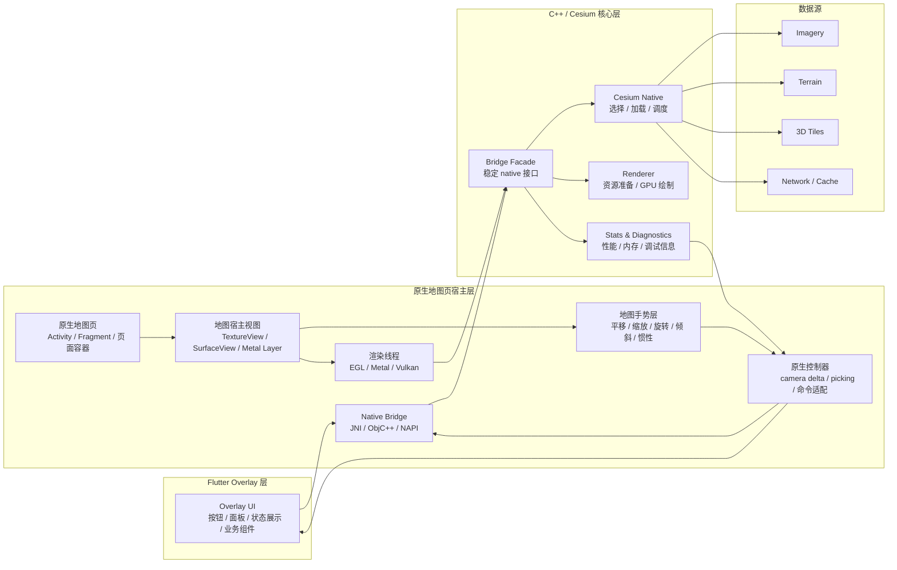

# 理想结构架构图

这份文档描述的是项目的目标态架构，也就是我们希望最终稳定收敛到的结构。

它不是对当前实现细节的逐行翻译，而是用来回答两个问题：

1. Flutter、原生层、Cesium Native 层各自应该负责什么。
2. 后续 iOS、HarmonyOS 扩展时，哪些边界应该保持不变。

## 总体目标

理想结构的核心原则是三层分责：

- Flutter 负责地图页面上方的业务 Overlay、产品层交互、业务编排、状态展示。
- Android/iOS/HarmonyOS 原生层负责地图页面宿主、生命周期、线程、平台桥接和地图交互输入。
- C++/Cesium Native 层负责地图核心能力、资源调度和渲染。

这样做的目标是让地图场景由原生页面直接掌控，把高频交互、手势和渲染路径留在原生与 C++ 层，同时让业务 UI 仍然尽量复用 Flutter。

## 理想结构图

## 分层职责

### 1. Flutter Overlay 层

Flutter 在这个目标结构里不再是地图页面宿主，而是覆盖在原生地图页上方的业务 UI 层。

应负责：

- 地图页面上方的业务按钮、浮层、面板、状态条。
- 页面级业务流程、产品层交互。
- 业务参数组织，例如定位到某地、切换模式、加载某类业务数据、触发清理动作。
- 原生统计信息展示。
- 业务数据与地图状态之间的组织和分发。
- 只在自身命中的区域消费触摸事件。

不应负责：

- 直接调用 Cesium Native C++ API。
- 直接承载地图级手势识别，例如拖拽平移、双指缩放、旋转、倾斜、惯性等。
- 作为地图渲染页的真正宿主。
- 维护渲染线程、GPU 资源或 tileset 生命周期。
- 承担平台图形细节。

### 2. 原生地图页宿主层

原生层是平台适配层，不是地图业务核心层。

应负责：

- 承载地图原生页面，例如 Android `Activity` / `Fragment` 或其他平台等价物。
- 创建和管理渲染表面。
- 处理 surface 生命周期、线程启动停止、尺寸变化、前后台切换。
- 维护稳定的平台桥接接口，把 Flutter Overlay 输入转给 C++，再把统计结果回传给 Flutter Overlay。
- 承担地图级手势系统，例如平移、缩放、旋转、倾斜、惯性和多手势竞争。
- 将平台触摸事件转换成统一的地图控制输入，例如 camera delta、拾取请求、模式切换执行。
- 决定事件分发边界：默认地图触摸归原生地图页，只有 Flutter Overlay 命中的区域由 Flutter 消费。

不应负责：

- 自己实现完整地图语义。
- 长期承载 tileset、选择逻辑、资源调度等 Cesium 核心能力。

### 3. C++ / Cesium Native 层

这是最终地图能力的中心。

应负责：

- Cesium Native 的 tileset 生命周期管理。
- 相机状态到 tile selection 的转换。
- 接收原生层传入的统一地图控制结果，并更新场景状态。
- 资源准备、GPU 上传、绘制组织。
- 运行时统计、性能指标、内存占用估算。
- 尽可能承载未来多平台共享的地图核心逻辑。

## 理想模块图

## 关键边界原则

1. Flutter 和 Cesium Native 之间不直接耦合。
2. 地图页面宿主归原生层，Flutter 作为页面上方的 Overlay UI 存在。
3. Flutter 负责产品层交互，不直接负责地图级手势系统。
4. 原生层暴露的是稳定平台接口，并负责地图手势到控制输入的转换，不暴露零散的 Cesium 内部细节。
5. Cesium 相关核心能力尽量收敛到 C++，避免未来在 Android 和 iOS 各写一套地图语义。
6. 渲染能力和业务能力分离，地图是内核，Flutter Overlay 是业务外壳。
7. 扩平台时复用的是这套边界，而不是 Android 的具体实现代码。

## 和当前项目的关系

当前仓库已经有这份理想结构的雏形：

- Flutter 层已经基本只负责 UI、控制和 stats 展示。
- Android 层已经承担 `PlatformView`、`TextureView`、EGL 和 JNI 宿主职责。
- 地图手势系统还没有作为独立职责块被明确实现出来。
- C++ 层已经开始承担 Cesium Native 链接、tile selection、资源准备和绘制。

还没有完全收敛的地方主要是：

- 当前实现还是 Flutter 页面内嵌原生地图视图，不是原生地图页宿主 + Flutter Overlay。
- 历史 PoC 文件名和文档叙事仍有残留。
- Android 生命周期硬化还不够完整。
- 地图手势层和原生控制器层还需要进一步显式建模。
- 多平台对称结构还没有落到 iOS/HarmonyOS。

## 使用建议

后续讨论架构时，建议同时区分两张图：

- 当前实现图：回答“现在代码实际怎么跑”。
- 理想结构图：回答“最终应该收敛成什么样”。

这份文档对应的是第二张图。
