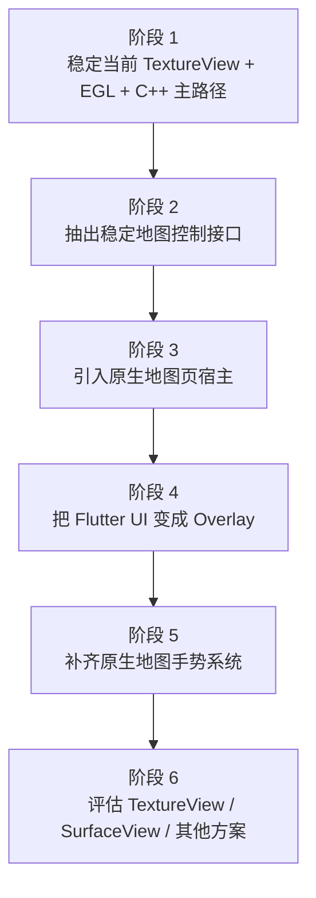

# 从当前实现到目标结构的迁移路径

这份文档回答的问题是：

当前项目还是“Flutter 页面内嵌原生地图视图”，如果目标结构改成“原生地图页 + Flutter Overlay”，应该怎么迁移。

这里强调的是低风险演进，而不是一次性重写。

## 当前结构

当前结构可以概括为：

```text
Flutter 页面
  ├─ Flutter 控制区和 stats
  └─ AndroidView / PlatformView
       └─ TextureView + EGL + NativeCesiumBridge + C++
```

这个结构的优点是：

- 当前已经能跑通主路径。
- Flutter 控制 UI 和原生地图已建立基本通信。
- C++ / Cesium Native 渲染链路已经开始成形。

它的主要限制是：

- 地图仍然是 Flutter 页面里的一个嵌入视图。
- 地图手势、页面生命周期、Overlay 事件边界还没有成为清晰的独立系统。
- 后续如果切到 `SurfaceView` 或更强原生宿主，Flutter 页面内嵌模式会增加复杂度。

## 目标结构

目标结构是：

```text
原生地图页
  ├─ 原生地图宿主视图
  ├─ 原生地图手势系统
  ├─ 渲染线程 / 生命周期 / Native bridge / C++
  └─ Flutter Overlay
       ├─ 业务按钮
       ├─ 面板
       ├─ 状态展示
       └─ 业务组件
```

这个结构的关键变化是：

- 地图页面宿主从 Flutter 切到原生页面。
- Flutter 从“页面宿主”变成“Overlay 业务 UI 层”。
- 地图手势默认归原生。

## 迁移总原则

1. 先保持现有 C++ 渲染路径不动。
2. 先搬页面宿主，再搬 UI 组织方式。
3. 先保证通信契约稳定，再优化手势和性能。
4. 每一步都要可单独验证、可单独回退。

## 推荐迁移阶段

### 阶段 1：稳定当前 Native 渲染主路径

目标：

- 保持现有 `TextureView + EGL + cesium_bridge` 主路径稳定。
- 不急着改页面结构。

这一步重点做：

- 补齐 surface 重建、暂停恢复、线程退出等生命周期问题。
- 明确当前 Flutter 到 native 的命令契约和状态契约。
- 让 stats、错误、日志回传更稳定。

完成标志：

- 当前嵌入式结构下，地图可稳定启动、切后台恢复、旋转或 resize 不崩。

不建议在这一步做：

- 大规模 UI 搬迁。
- 手势系统重构。
- 渲染后端切换。

### 阶段 2：抽出稳定的地图控制接口

目标：

- 让 Flutter 和原生之间的通信从“当前页面实现”中解耦。

这一步重点做：

- 把命令整理成稳定接口，例如：
  - `updateCamera`
  - `setInteractionMode`
  - `clearMemory`
  - `setOverlayState`
  - `loadScene` 或等价命令
- 把 native 回传整理成稳定事件，例如：
  - `stats`
  - `cameraChanged`
  - `selectionChanged`
  - `error`

完成标志：

- 即使以后 Flutter 不再是页面宿主，当前业务控制仍然能通过同一套接口驱动原生地图。

### 阶段 3：引入原生地图页宿主

目标：

- 让地图从“Flutter 页面中的子视图”变成“原生页面中的主视图”。

这一步重点做：

- 新建 Android 原生地图页，例如 `Activity` 或 `Fragment`。
- 把现有 `TextureView + EGL + NativeCesiumBridge` 宿主迁移到这个原生地图页中。
- 暂时可以先不放 Flutter Overlay，只验证原生地图页本身。

完成标志：

- 地图可以在原生页面中独立跑起来。
- 生命周期由原生页直接驱动。

回退条件：

- 如果原生页宿主下生命周期问题明显增多，可以临时回到嵌入式结构继续稳定底层，再重新切页宿主。

### 阶段 4：把 Flutter UI 变成 Overlay

目标：

- 把 Flutter 从页面宿主降级为地图页上方的业务 UI 层。

这一步重点做：

- 在原生地图页上叠加 `FlutterView` 或等价 Flutter 容器。
- 先迁移最简单的 Overlay 组件：
  - stats
  - 按钮
  - 简单面板
- 明确事件边界：
  - Overlay 命中区域由 Flutter 消费
  - 非命中区域触摸落到原生地图

完成标志：

- 地图页已经是原生宿主。
- Flutter 只负责上方业务 UI。
- 基础按钮和 stats 正常工作。

### 阶段 5：补齐原生地图手势系统

目标：

- 地图操作彻底归原生层，不再依赖 Flutter 页面结构。

这一步重点做：

- 实现平移、缩放、旋转、倾斜、惯性。
- 实现手势竞争和中断规则。
- 把手势结果转换成统一 camera delta 或控制命令。
- 根据需要回传相机状态给 Flutter Overlay。

完成标志：

- 地图的核心交互可以在没有 Flutter 手势参与的前提下稳定完成。

### 阶段 6：视图宿主与渲染方案再评估

目标：

- 在新页面结构稳定后，再判断是否继续使用 `TextureView`。

这一步重点做：

- 对比 `TextureView` 与 `SurfaceView`。
- 采集：
  - fps
  - 掉帧
  - 内存
  - 输入延迟
  - surface 复杂度
- 再决定是否切换宿主视图或进一步升级渲染方案。

完成标志：

- 性能决策建立在实测基础上，而不是先验偏好上。

## 推荐迁移顺序图



## 每阶段的验证重点

### 阶段 1 验证

- 启动稳定。
- 后台恢复稳定。
- surface 重建不崩。
- stats 回传连续。

### 阶段 2 验证

- Flutter 控制命令和 native 事件接口稳定。
- 页面结构变化后，接口仍可复用。

### 阶段 3 验证

- 原生地图页独立可运行。
- 原生页生命周期和渲染线程一致。

### 阶段 4 验证

- Overlay 显示正常。
- Overlay 只截获命中区域触摸。
- 非命中区域地图仍可流畅操作。

### 阶段 5 验证

- 平移、缩放、旋转、倾斜、惯性行为符合预期。
- 多手势竞争不会卡死或跳变。

### 阶段 6 验证

- 性能、稳定性、Overlay 兼容性一起评估。
- 不只看峰值帧率，也看宿主复杂度和维护成本。

## 建议暂时不要做的事

- 不要在迁移页面宿主时同时切换 Vulkan。
- 不要在手势系统未独立前就大量重写 Flutter UI。
- 不要在原生页未稳定前就删除当前嵌入式实现。

## 一句话建议

最好的迁移节奏不是“推倒重来”，而是：

先稳住当前 native 渲染链路，再抽接口，再切宿主，再叠 Flutter Overlay，最后再补手势和评估性能升级。
